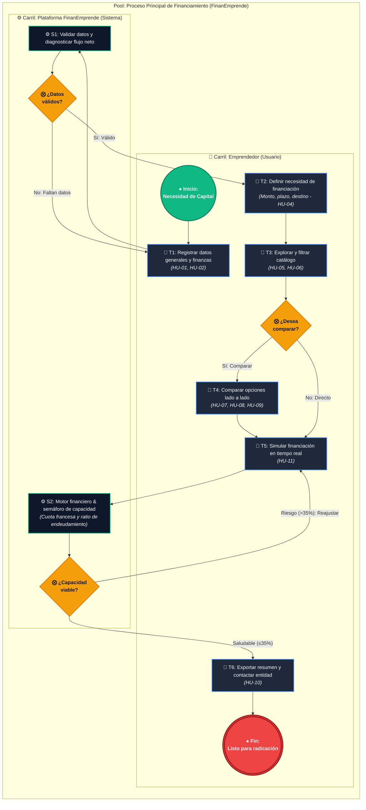

# Modelo de Procesos de Negocio BPMN 2.0 (Simplificado) — FinanEmprende

**Proyecto:** FinanEmprende — Búsqueda de Alternativas de Financiamiento para Emprendedores  
**Autores:** Moises Joshua Herrera Galindo, Juan Sebastián Molina Ballesteros, Miguel Angel Gallego Franco, Sebastián Rendón Grisales  
**Versión:** 2.0 (Modelo Ejecutivo Simplificado)  
**Estándar:** BPMN 2.0 (Business Process Model and Notation)  

---

## 📁 Archivos Disponibles en este Repositorio

1. 📐 **Diagrama Editable en Draw.io / diagrams.net:**  
   [`docs/proceso-finanemprende.drawio`](file:///c:/Users/Asus/Documents/GitHub/financimiento/docs/proceso-finanemprende.drawio)  
   *Archivo XML listo para abrir directamente en [app.diagrams.net](https://app.diagrams.net), Draw.io Desktop o la extensión de VS Code.*
2. ⚙️ **Diagrama Estándar OMG BPMN 2.0 XML:**  
   [`docs/proceso-finanemprende.bpmn`](file:///c:/Users/Asus/Documents/GitHub/financimiento/docs/proceso-finanemprende.bpmn)  
   *Compatible con Camunda Modeler, Signavio, bpmn.io y herramientas CASE corporativas.*
3. 🌐 **Visor Interactivo en Navegador Web (HTML/SVG):**  
   [`docs/bpmn-proceso-finanemprende.html`](file:///c:/Users/Asus/Documents/GitHub/financimiento/docs/bpmn-proceso-finanemprende.html)  
   *Visor interactivo con pan & zoom, modo oscuro y simulación paso a paso.*

---

## 1. Diagrama de Proceso Simplificado (Mermaid)

Este modelo reúne las actividades críticas del flujo de usuario y la lógica matemática del sistema, eliminando micro-acciones redundantes para una sustentación ejecutiva de alto impacto:

---

## 2. Descripción de Carriles y Responsabilidades

| Carril | Rol | Responsabilidades Clave en el Proceso |
| :--- | :--- | :--- |
| **👤 Emprendedor (Usuario)** | Líder del Emprendimiento | Ingresa datos de perfil y estados de ventas/costos; define requerimientos de fondos; aplica filtros; revisa comparativas; ajusta sliders de simulación y descarga el reporte final. |
| **⚙️ Plataforma FinanEmprende** | Sistema & Motor Financiero | Valida integridad de campos; calcula márgenes de operación; convierte tasas E.A. a mensual vencida; calcula cuotas fijas (Sistema Francés) y computa el semáforo de capacidad de endeudamiento. |

---

## 3. Matriz de Tareas del Modelo Simplificado

| ID | Tipo de Tarea | Nombre | Historias de Usuario | Descripción |
| :---: | :---: | :--- | :---: | :--- |
| **T1** | *User Task* | Registrar Datos y Finanzas | **HU-01, HU-02** | Registro de nombre, sector, etapa, ciudad, empleados, ventas y costos operacionales mensuales. |
| **S1** | *Service Task* | Validar & Diagnosticar | **HU-02** | Validación de ventas $> 0$ y costos $> 0$. Cálculo de flujo de caja neto y margen operativo. |
| **GW1** | *Exclusive Gateway* | ¿Datos Válidos? | — | Si faltan datos, retorna con alertas en rojo a `T1`. Si es válido, avanza a `T2`. |
| **T2** | *User Task* | Definir Necesidad | **HU-04** | Selección de monto ($ COP), plazo (6-60 meses) y destino de inversión (capital de trabajo, etc.). |
| **T3** | *User Task* | Explorar & Filtrar Catálogo | **HU-05, HU-06** | Consulta de ofertas (Bancos, Fintechs, SENA) con filtrado por categoría y coincidencia de monto. |
| **GW2** | *Exclusive Gateway* | ¿Desea Comparar? | — | Permite bifurcar hacia la matriz comparativa de hasta 3 opciones o ir directo a simular. |
| **T4** | *User Task* | Comparar Alternativas | **HU-07, HU-08, HU-09** | Matriz lado a lado: contraste de cuotas, tasas E.A., tiempos de respuesta, ventajas y desventajas. |
| **T5** | *User Task* | Simular Financiación | **HU-11** | Sliders interactivos de monto, plazo y tasa E.A. para calibrar el escenario deseado. |
| **S2** | *Script Task* | Motor Financiero & Semáforo | **HU-11** | Amortización francesa de cuota fija y ratio $\left(\frac{\text{Cuota}}{\text{Ventas}}\right) \times 100$. |
| **GW3** | *Exclusive Gateway* | ¿Capacidad Viable? | **HU-11** | Si el semáforo marca Riesgo ($>35\%$), retorna a `T5` para alargar plazo o bajar monto. Si es viable ($\le 35\%$), avanza a `T6`. |
| **T6** | *User Task* | Exportar y Contactar | **HU-10** | Impresión/PDF del reporte financiero y redirección al portal web oficial de la entidad financiera. |

---

## 4. Instrucciones para Abrir y Editar en Draw.io

1. Ingresa a [https://app.diagrams.net](https://app.diagrams.net) (o abre la app de escritorio de Draw.io).
2. Haz clic en **"Abrir diagrama existente"** (Open Existing Diagram).
3. Selecciona el archivo [`docs/proceso-finanemprende.drawio`](file:///c:/Users/Asus/Documents/GitHub/financimiento/docs/proceso-finanemprende.drawio).
4. El diagrama se cargará con su cuadrícula alineada, colores del sistema de diseño (modo oscuro corporativo), tipografía legible y conectores ortogonales listos para editar o exportar a PNG/SVG/PDF.
