# Modelo de Procesos de Negocio (BPMN 2.0) — FinanEmprende

**Proyecto:** FinanEmprende — Búsqueda y Simulación de Alternativas de Financiamiento para Emprendedores  
**Autores:** Moises Joshua Herrera Galindo, Juan Sebastián Molina Ballesteros, Miguel Angel Gallego Franco, Sebastián Rendón Grisales  
**Versión del Proceso:** 1.0 (Entrega 1)  
**Estándar:** BPMN 2.0 (Business Process Model and Notation)  

---

## 1. Diagrama de Procesos BPMN 2.0 (Mermaid)

El siguiente diagrama modela el flujo end-to-end del proceso de negocio utilizando **Piscinas (Pools)**, **Carriles (Swimlanes)**, **Tareas tipificadas** (Usuario, Servicio, Script), **Compuertas de Decisión Exclusiva (XOR)** y **Eventos**:

```mermaid
flowchart TD
    %% ==========================================
    %% POOL: PROCESO FINANEMPRENDE
    %% ==========================================
    subgraph Pool ["Pool: Proceso de Búsqueda, Evaluación y Simulación de Financiamiento (FinanEmprende)"]
        direction TB

        %% ==========================================
        %% CARRILES (SWIMLANES)
        %% ==========================================
        subgraph LaneUser ["👤 Carril: Emprendedor (Usuario)"]
            direction TB
            Start((● Inicio:<br/>Necesidad de Capital))
            
            U1["👤 T1: Registrar datos generales del negocio<br/><i>(HU-01)</i>"]
            U2["👤 T2: Registrar ventas y costos mensuales<br/><i>(HU-02)</i>"]
            GW1{"⨂ ¿Datos de perfil<br/>válidos?"}
            U3["👤 T3: Definir requerimiento de financiación<br/><i>(Monto, plazo, destino - HU-04)</i>"]
            GW2{"⨂ ¿Monto y plazo<br/>válidos?"}
            
            U4["👤 T4: Explorar catálogo de alternativas<br/><i>(HU-05)</i>"]
            U5["👤 T5: Filtrar por categoría, monto y texto<br/><i>(HU-06)</i>"]
            GW3{"⨂ ¿Desea comparar<br/>alternativas?"}
            
            U6["👤 T6: Seleccionar hasta 3 opciones y abrir matriz<br/><i>(HU-07)</i>"]
            U7["👤 T7: Analizar costos, requisitos, pros y contras<br/><i>(HU-08, HU-09)</i>"]
            U8["👤 T8: Seleccionar opción para simulación"]
            
            U9["👤 T9: Ajustar variables en simulador<br/><i>(Monto, plazo, tasa E.A. - HU-11)</i>"]
            GW4{"⨂ ¿Semáforo de<br/>endeudamiento<br/>saludable?"}
            
            U10["👤 T10: Exportar / Imprimir reporte financiero"]
            U11["👤 T11: Clic al enlace oficial de la entidad<br/><i>(HU-10)</i>"]
            EndSuccess(((● Fin:<br/>Listo para radicación)))
        end

        subgraph LaneSystem ["⚙️ Carril: Plataforma FinanEmprende (Frontend & Motor Financiero)"]
            direction TB
            S1["⚙️ S1: Validar formato y restricciones de campos"]
            S2["⚙️ S2: Calcular flujo neto mensual y margen operacional"]
            S3["⚙️ S3: Desbloquear Paso 2 en Stepper"]
            S4["⚙️ S4: Desbloquear Paso 3 (Catálogo)"]
            S5["⚙️ S5: Consultar y cargar portafolio de ofertas"]
            S6["⚙️ S6: Calcular cuota preliminar estimada por opción"]
            S7["⚙️ S7: Construir matriz comparativa frente a frente"]
            S8["⚙️ S8: Desbloquear Paso 4 (Simulador)"]
            S9["⚙️ S9: Motor Financiero:<br/>• Tasa E.A. a Mensual Vencida<br/>• Amortización Sistema Francés<br/>• Intereses totales proyectados"]
            S10["⚙️ S10: Semáforo de capacidad:<br/>• Saludable (&lt;20%)<br/>• Moderado (20-35%)<br/>• Riesgo (&gt;35%)"]
            S11["⚙️ S11: Generar resumen estructurado imprimible"]
        end

        subgraph LaneEntity ["🏛️ Carril: Entidades Financieras / Ecosistema Externo"]
            direction TB
            DB_Offers[("🗄️ Portafolio de productos:<br/>Bancolombia, Sempli, SENA, Bancamía")]
            E1["🏛️ E1: Publicar tasas, plazos y requisitos legales"]
            E2["🏛️ E2: Recibir postulación formal en portal oficial"]
            EndEntity(((● Fin:<br/>Radicación iniciada)))
        end
    end

    %% ==========================================
    %% FLUJO SECUENCIAL (SEQUENCE FLOWS)
    %% ==========================================
    Start --> U1
    U1 --> U2
    U2 --> S1
    S1 --> S2
    S2 --> GW1
    GW1 -- "No: Corregir" --> U1
    GW1 -- "Sí: Válido" --> S3
    S3 --> U3
    U3 --> GW2
    GW2 -- "No: Monto &le; 0" --> U3
    GW2 -- "Sí: Válido" --> S4
    S4 --> S5
    DB_Offers -.-> S5
    S5 --> S6
    S6 --> U4
    U4 --> U5
    U5 --> GW3
    
    %% Ruta de Comparación
    GW3 -- "Sí: Comparar" --> U6
    U6 --> S7
    S7 --> U7
    U7 --> U8
    
    %% Ruta Directa al Simulador
    GW3 -- "No: Selección directa" --> U8
    
    U8 --> S8
    S8 --> U9
    U9 --> S9
    S9 --> S10
    S10 --> GW4
    
    %% Decisión del Semáforo
    GW4 -- "Riesgo (&gt;35%): Inviable" --> U9
    GW4 -- "Saludable (&le;35%): Viable" --> U10
    
    U10 --> S11
    S11 --> U11
    U11 --> EndSuccess
    
    %% Conexión externa
    U11 -. "Redirección externa" .-> E2
    E2 --> EndEntity
    E1 -. "Actualización de oferta" .-> DB_Offers

    %% ==========================================
    %% ESTILOS VISUALES BPMN
    %% ==========================================
    classDef startEv fill:#10B981,stroke:#047857,stroke-width:2px,color:#FFFFFF,font-weight:bold;
    classDef endEv fill:#EF4444,stroke:#991B1B,stroke-width:3px,color:#FFFFFF,font-weight:bold;
    classDef userTask fill:#1E293B,stroke:#3B82F6,stroke-width:2px,color:#F8FAFC;
    classDef serviceTask fill:#0F172A,stroke:#10B981,stroke-width:2px,color:#F8FAFC;
    classDef gateway fill:#F59E0B,stroke:#D97706,stroke-width:2px,color:#0F172A,font-weight:bold;
    classDef dataStore fill:#1E293B,stroke:#64748B,stroke-width:2px,stroke-dasharray: 4 4,color:#94A3B8;

    class Start startEv;
    class EndSuccess,EndEntity endEv;
    class U1,U2,U3,U4,U5,U6,U7,U8,U9,U10,U11 userTask;
    class S1,S2,S3,S4,S5,S6,S7,S8,S9,S10,S11 serviceTask;
    class GW1,GW2,GW3,GW4 gateway;
    class DB_Offers dataStore;
```

---

## 2. Descripción de Participantes (Pools y Carriles)

| Elemento BPMN | Nombre | Rol y Responsabilidad |
| :--- | :--- | :--- |
| **Pool (Piscina)** | `FinanEmprende` | Engloba todo el ciclo de vida de búsqueda, evaluación y simulación de crédito o capital emprendedor. |
| **Carril 1 (Lane)** | `Emprendedor (Usuario)` | Representa al usuario final (fundador o líder del negocio) que ingresa información contable, define su necesidad de capital, filtra alternativas, analiza la matriz comparativa y realiza la simulación interactiva. |
| **Carril 2 (Lane)** | `Plataforma FinanEmprende` | Agrupa el Frontend (React + Vite), el control de navegación secuencial por estados (candados de Stepper) y el Motor Financiero matemático (conversión de tasas, sistema de amortización francés y semáforo de capacidad de endeudamiento). |
| **Carril 3 (Lane)** | `Entidades Financieras` | Representa a las instituciones externas (Bancolombia, Sempli Fintech, Fondo Emprender SENA, Bancamía, etc.) que proveen las opciones de financiamiento y reciben al emprendedor en sus canales oficiales para la radicación final. |

---

## 3. Matriz de Trazabilidad: Tareas BPMN vs. Historias de Usuario

| ID Tarea | Tipo BPMN | Nombre de la Actividad | Historia de Usuario (HU) | Descripción Técnica en el Proyecto |
| :---: | :---: | :--- | :---: | :--- |
| **T1** | *User Task* | Registrar datos generales del negocio | **HU-01** | Captura nombre comercial, representante/fundador, sector económico, etapa (Idea, Temprana, Crecimiento), ciudad, años de operación y empleados. |
| **T2** | *User Task* | Registrar ventas y costos mensuales | **HU-02** | Captura de ingresos operacionales promedio y costos/gastos mensuales recurrentes. |
| **S1** | *Service Task* | Validar formato y restricciones de campos | N/A | Valida campos requeridos: `sales > 0`, `costs > 0`, cadenas no vacías. Alerta en caso de campos faltantes. |
| **S2** | *Script Task* | Calcular flujo neto y margen operacional | **HU-02** | `netCash = sales - costs`, `operatingMargin = (netCash / sales) * 100`. Se actualiza en el panel lateral reactivo. |
| **S3** | *Service Task* | Desbloquear Paso 2 en Stepper | N/A | `setMaxUnlockedStep(prev => Math.max(prev, 2))` para habilitar acceso seguro. |
| **T3** | *User Task* | Definir requerimiento de financiación | **HU-04** | Selección de monto ($ COP), plazo (6 a 60 meses), destino de inversión (capital de trabajo, maquinaria, etc.) y tasa máx. aceptable. |
| **S4** | *Service Task* | Desbloquear Paso 3 (Catálogo) | N/A | Habilita la navegación hacia el catálogo de fuentes financieras. |
| **S5** | *Service Task* | Consultar catálogo de ofertas | **HU-05**, **HU-10** | Consulta el repositorio `mockFinancingOptions` con detalles institucionales, tasas, plazos y requisitos. |
| **S6** | *Script Task* | Calcular cuotas preliminares estimadas | **HU-08** | Calcula cuota mensual referencial en cada tarjeta en función del monto y plazo definidos en el Paso 2. |
| **T4** | *User Task* | Explorar catálogo de alternativas | **HU-05** | Visualización de alternativas clasificadas por categorías del ecosistema colombiano. |
| **T5** | *User Task* | Filtrar por categoría, monto y texto | **HU-06** | Filtrado reactivo con `useMemo`: por tabs de categoría, checkbox de rango de monto y buscador en tiempo real. |
| **T6** | *User Task* | Seleccionar opciones para comparativa | **HU-07** | Permite marcar hasta 3 alternativas simultáneas con validación de límite. |
| **S7** | *Service Task* | Construir matriz comparativa frente a frente | **HU-07** | Renderiza modal comparativo destacando automáticamente la alternativa con menor tasa E.A. comercial. |
| **T7** | *User Task* | Analizar costos, requisitos, pros y contras | **HU-08**, **HU-09** | Evaluación de cuotas estimadas, intereses totales, requisitos legales, ventajas competitivas y desventajas. |
| **T8** | *User Task* | Seleccionar opción para simulación | **HU-11** | Transfiere la entidad seleccionada al estado global `activeOptionForSim` y desbloquea el Paso 4. |
| **T9** | *User Task* | Ajustar variables en simulador | **HU-11** | Sliders interactivos de monto ($ COP), plazo (meses) y tasa (% E.A.) o modo manual libre. |
| **S9** | *Script Task* | Ejecutar motor financiero | **HU-11** | Convierte Tasa E.A. a Mensual Vencida, calcula cuota fija fija (Francés), interés total y total a pagar. |
| **S10** | *Script Task* | Evaluar semáforo de capacidad | **HU-11** | Calcula el ratio `(cuota / ventas) * 100` y clasifica en Saludable (&le;20%), Moderado (20-35%) o Riesgo (&gt;35%). |
| **T10** | *User Task* | Exportar / Imprimir reporte financiero | N/A | Generación de vista de impresión limpia (`window.print()`) con resumen del crédito y semáforo. |
| **T11** | *User Task* | Redirección a portal oficial de la entidad | **HU-10** | Clic en enlace externo oficial de la entidad financiera (Bancolombia, Sempli, Fondo Emprender, Bancamía). |

---

## 4. Compuertas de Decisión (Gateways) y Reglas de Negocio

### Compuerta 1: `GW1 (¿Datos de perfil válidos?)`
* **Tipo:** Exclusiva basada en datos (XOR).
* **Condición de Salida (Sí):** Nombre comercial no vacío, fundador no vacío, ciudad no vacía, ventas mensuales $> 0$, costos mensuales $> 0$.
* **Condición de Salida (No):** Si algún campo falla, el sistema muestra alertas visuales en rojo en el formulario y retiene al usuario en el Paso 1.

### Compuerta 2: `GW2 (¿Monto y plazo válidos?)`
* **Tipo:** Exclusiva basada en datos (XOR).
* **Condición de Salida (Sí):** Monto solicitado $> 0$ COP y Plazo seleccionado $\ge 6$ meses.
* **Condición de Salida (No):** Bloqueo de avance hasta subsanar el valor.

### Compuerta 3: `GW3 (¿Desea comparar alternativas?)`
* **Tipo:** Exclusiva basada en decisión del usuario (XOR).
* **Ruta "Sí":** El usuario marca entre 2 y 3 opciones y abre el modal de comparativa lado a lado (**HU-07**).
* **Ruta "No":** El usuario hace clic directo en el botón *"Simular"* de una tarjeta específica o navega al Paso 4 para parametrización personalizada.

### Compuerta 4: `GW4 (¿Semáforo de endeudamiento viable?)`
* **Tipo:** Exclusiva basada en evaluación matemática (XOR).
* **Criterio de Evaluación:**
  $$\text{Ratio de Endeudamiento} = \left( \frac{\text{Cuota Mensual}}{\text{Ventas Mensuales}} \right) \times 100$$
* **Ramas:**
  1. **Saludable ($\le 20\%$):** Color Esmeralda. Endeudamiento óptimo. Se recomienda proceder.
  2. **Moderado ($20\% \text{ a } 35\%$):** Color Ámbar. Viable con gestión de flujo de caja.
  3. **Riesgo ($> 35\%$):** Color Carmesí/Rojo. Alerta de sobreendeudamiento. El sistema sugiere retroalimentar las variables (aumentar plazo para reducir cuota, disminuir monto, o cambiar a Capital Semilla no reembolsable).

---

## 5. Fórmulas Financieras Empleadas en el Motor

### 5.1 Conversión de Tasa Efectiva Anual (E.A.) a Mensual Vencida ($i$)
$$i = (1 + i_{\text{E.A.}})^{1/12} - 1$$

### 5.2 Amortización con Cuota Fija Mensual (Sistema Francés)
$$\text{Cuota} = P \times \frac{i \times (1 + i)^n}{(1 + i)^n - 1}$$
*Donde $P$ es el monto principal, $i$ es la tasa mensual vencida y $n$ es el número de meses.*

### 5.3 Total a Pagar e Intereses Totales Proyectados
$$\text{Total Pagar} = \text{Cuota} \times n$$
$$\text{Total Intereses} = \text{Total Pagar} - P$$
